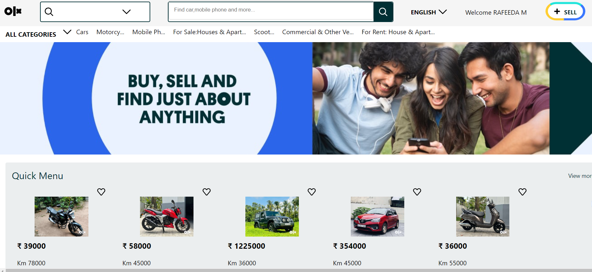
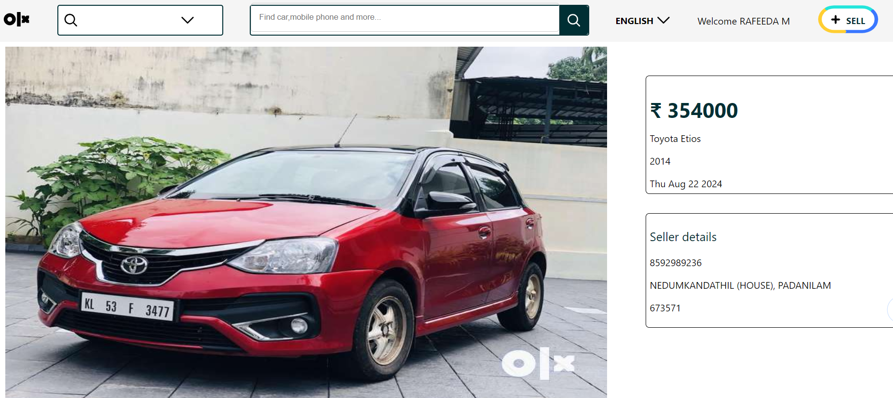

# OLX Clone

## Overview

OLX Clone is a web application built with React.js and Google Firebase. This project mimics the functionality of the OLX marketplace, allowing users to create accounts, log in, sell products, and view product details.

## Features

- **User Registration & Authentication**: 
  - Users can create an account with a username, password, address, pincode, and mobile number.
  - Authentication is handled via email and password.

- **Product Listing**:
  - Users can sell products by uploading pictures and providing details such as manufacturing date and model name.
  - Products are displayed on the homepage with brief details.

- **Product Details**:
  - Clicking on a product provides detailed information, including the user who created the listing.

## Technologies Used

- **Frontend**:
  - React.js
  - CSS

- **Backend**:
  - Google Firebase
    - Firebase Authentication
    - Firebase Firestore
    - Firebase Storage

## Installation

1. **Clone the Repository**:
   ```bash
   https://github.com/be19b028ramshidnk/Olx-React-Project.git
   cd olx

## Screenshots




